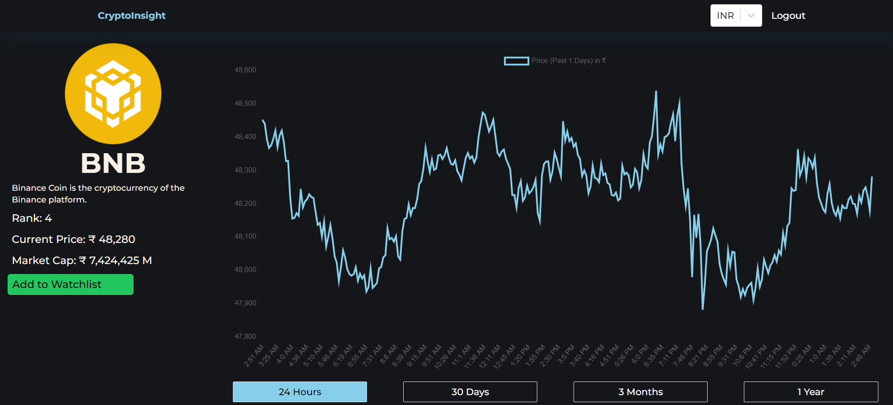
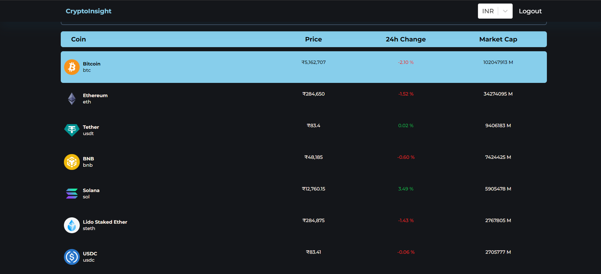

<h1 align="center">
Coin-Stats
</h1>

<h2 align="center">
  ReactJs + ChartJs 💰Crypto Coin Tracker Web App📈 
</h2>

Here I plan to build an app to track the crypto currency and plot their graph. Users can view all the latest cryptocurrencies. They can search for any cryptocurrency and view their historical chart  in a 24 hours change, 30 days change, 3 months change and 1 year change. 

#### check out the deployed project :https://cryptosinsights.vercel.app/
## :fire: Features

:white_check_mark: Clean interface  \
:white_check_mark: Easy to Navigate dashboard \
:white_check_mark: No reloading of whole page \
:white_check_mark: Fine charts from Chart.js \
:white_check_mark: Latest updates of all crypto at your fingertips  \
:white_check_mark: Stats from 24hr to 1 year \

## 🛠️ Technologies used 
The technology used are
-- Enhancement in UI
- [React](https://reactjs.org/)
- [ChartJs](https://www.npmjs.com/package/react-chartjs-2)
- [GitHub](https://github.com)
- [vercel](https://vercel.com)

